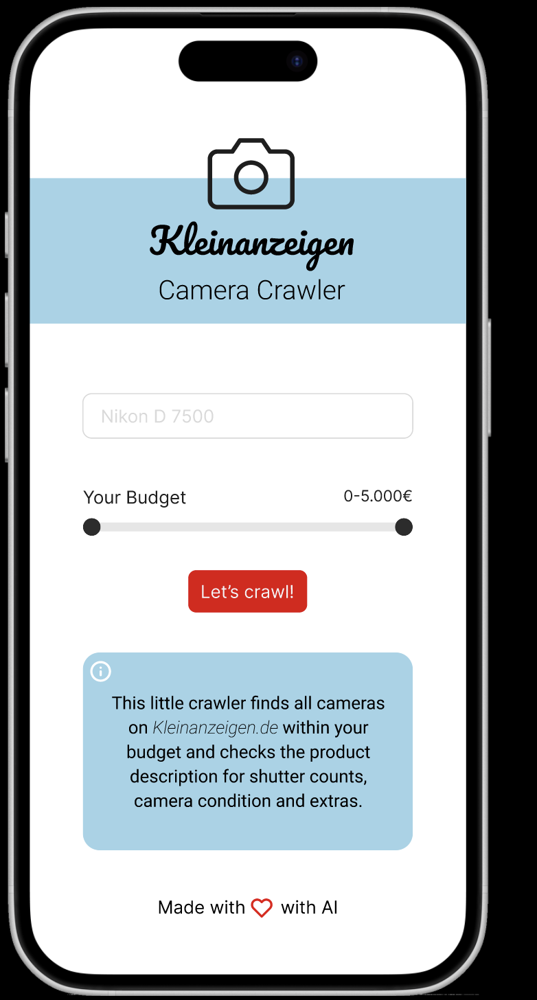

# Camera Crawler

Camera Crawler WebApp based on Python, ML and NLP techniques as well as Ionic and TypeScript.

This application is able to scan the German _Kleinanzeigen_ website for a cameras the user is interested in. It checks the product descriptions for shutter counts, camera condition and extras.

The Mock-Up/Prototype of the App can be found [here](https://www.figma.com/proto/7BVitOpKyGlPLy78lpgwLQ/Camera-Crawler?page-id=0%3A1&node-id=1-2&node-type=canvas&viewport=-35%2C189%2C0.92&t=JgcSaZIYlKcvwtXW-1&scaling=scale-down&content-scaling=fixed) (created with Figma).

 

Project is 🚧 under construction 🚧. More detailed NLP and ML script can be found [here](https://github.com/JaninaBistron/PriceTracker).
